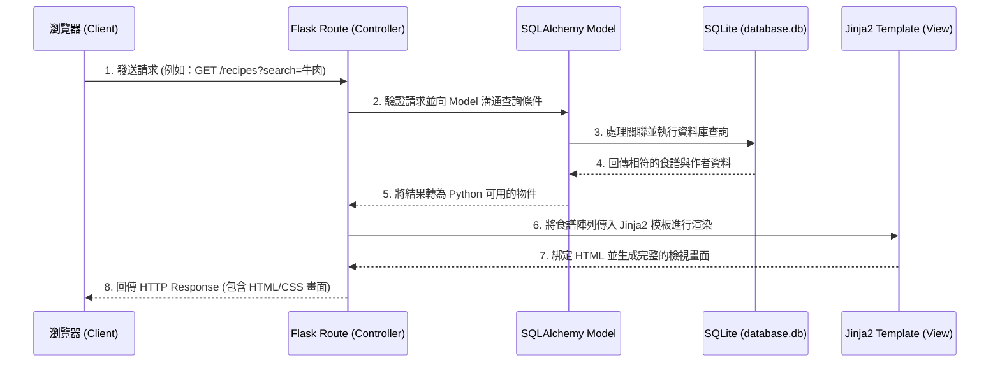

# 系統架構文件 (Architecture) - 食譜收藏夾系統

## 1. 技術架構說明

本專案是一個不需要前後端分離的網頁應用程式，頁面渲染交由後端處理。這是一個相對簡單且對開發速度友善的架構，能夠快速驗證「食譜收藏夾」的核心業務邏輯。

### 選用技術與原因
- **後端：Python + Flask**
  輕量級的微框架，具有高度的彈性，非常適合用來快速打造 MVP，並能輕鬆整合外部套件或爬蟲腳本。
- **模板引擎：Jinja2**
  Flask 原生支援的強大視圖渲染引擎，可以根據後端傳遞的資料動態生成 HTML 介面，無需在前端撰寫大量複雜的邏輯。
- **資料庫：SQLite (搭配 SQLAlchemy ORM)**
  無需額外架設資料庫伺服器，檔案級別的跨平台資料庫，方便本機開發、測試與後續部署。透過 SQLAlchemy 可以用 Python 物件語法取代純 SQL 語法，大幅提高開發效率與維持程式碼整潔。

### Flask MVC 模式說明
雖然 Flask 不強制規範專案佈局，但本專案將依照 MVC (Model-View-Controller) 設計概念劃分職責：
- **Model (模型)**：負責定義與溝通資料庫（SQLite），包含使用者、食譜、評價、購物清單等資料表與商業邏輯。位於 `app/models/`。
- **Controller (控制器)**：負責接收瀏覽器的 HTTP 請求，執行核心邏輯判斷、向 Model 提取資料，最後指定該回傳的頁面。在 Flask 裡對應著路由設定檔。位於 `app/routes/`。
- **View (視圖)**：負責最終產生給使用者看的前端畫面。Controller 再將資料塞入 Jinja2 模板渲染後回傳給使用者。位於 `app/templates/`。

---

## 2. 專案資料夾結構

本專案採用 Flask 的應用程式工廠模式 (Application Factory Pattern)，結構清晰，容易在未來擴充與進行專案測試。

```text
web_app_development/
├── app/                      ← 應用程式主目錄
│   ├── __init__.py           ← 初始化 Flask app 與載入各種擴展套件
│   ├── models/               ← 資料庫模型 (Model)
│   │   ├── __init__.py
│   │   ├── user.py           ← 使用者資料表
│   │   ├── recipe.py         ← 食譜資料表（收藏記錄與自己上傳的文章）
│   │   ├── interaction.py    ← 評價與留言功能
│   │   └── shopping.py       ← 購物清單功能
│   ├── routes/               ← 路由藍圖 (Controller)
│   │   ├── __init__.py
│   │   ├── auth.py           ← 處理登入、註冊與登出
│   │   ├── recipe.py         ← 食譜搜尋、瀏覽、新增等核心功能
│   │   └── user_action.py    ← 加入購物清單、給定評價等額外操作
│   ├── templates/            ← Jinja2 HTML 模板 (View)
│   │   ├── base.html         ← 全域基礎共用版型 (Header導流列, Footer等)
│   │   ├── auth/             ← 登入、註冊表單頁面
│   │   ├── recipe/           ← 食譜列表首頁、食譜詳細內容頁、新增食譜頁
│   │   └── profile/          ← 個人頁面與使用者採買購物清單
│   └── static/               ← 存放網頁的靜態檔案 
│       ├── css/              ← 負責全站視覺風格的樣式表
│       ├── js/               ← 前端畫面的動態互動腳本
│       └── images/           ← 預設圖片、Logo 與網站圖標
├── instance/                 ← 不放入版本控制的私有層
│   └── database.db           ← 系統 SQLite 實體資料庫檔案
├── docs/                     ← 開發過程的設計文件 (如 PRD.md, ARCHITECTURE.md)
├── config.py                 ← 開發、測試或正式環境的通用設定值
├── requirements.txt          ← 此專案依賴的 Python 套件與版本
└── app.py                    ← 啟動整個系統的入口程式
```

---

## 3. 元件關係圖

以下列出一般使用者請求「網頁操作」時，系統內部的運作流程：



---

## 4. 關鍵設計決策

1. **模組化路由 (Blueprints)**
   - **原因**：為了預防 `app.py` 長大變為凌亂的千行程式碼，所有的路由與視圖函式將分類註冊在 `app/routes/` 底下（如 auth, recipe 等）。這樣能讓邏輯清楚解耦，開發起來也更流暢。
2. **選擇 SQLAlchemy 取代直接執行 SQL 語法**
   - **原因**：食譜系統高度依賴多對多與一對多關聯（一位使用者能收藏多個食譜，一篇食譜能有多條評價等）。使用 SQLAlchemy ORM，可以用 `user.recipes` 這種物件語法取代容易出錯的 JOIN 查詢，並有效降低未來切換不同資料庫系統的成本以及 SQL Injection 問題。
3. **傳統 Session Cookie 認證模式 (Flask-Login)**
   - **原因**：既然採用「後端模板渲染 (Jinja2)」而非前後端分離架構，捨去複雜的存取權杖 (JWT Token)。使用原生的 Session 儲存配合套件管理，最簡單、安全而且完全切合我們選擇的渲染流派。
4. **MVP 階段的購物清單結構**
   - **原因**：若食材種類太雜，一開始將資料全正規化為「Ingredients」表可能太複雜。我們在初始階段可以先使用 JSON 格式儲存在欄位內，等平台擴展至特定規模（需要進階庫存與採買統計）時，再將其獨立成一張完整的資料庫關聯表，以求縮短產品初期的迭代時間。
