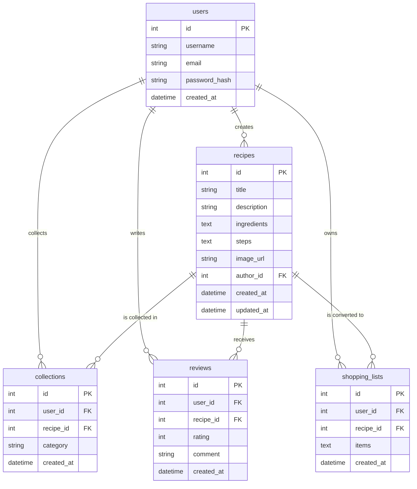

# 資料庫設計文件 (DB Design) - 食譜收藏夾系統

## 1. ER 圖（實體關係圖）

## 2. 資料表詳細說明

### `users`（使用者表）
記錄所有註冊使用者的基本資料。
- `id`: INTEGER PRIMARY KEY AUTOINCREMENT (使用者唯一識別碼)
- `username`: TEXT NOT NULL (使用者名稱)
- `email`: TEXT NOT NULL UNIQUE (登入帳號用的電子郵件)
- `password_hash`: TEXT NOT NULL (加密後的密碼)
- `created_at`: DATETIME DEFAULT CURRENT_TIMESTAMP (註冊時間)

### `recipes`（食譜表）
記錄所有上傳的食譜資料。
- `id`: INTEGER PRIMARY KEY AUTOINCREMENT (食譜唯一識別碼)
- `title`: TEXT NOT NULL (食譜標題)
- `description`: TEXT (食譜簡介)
- `ingredients`: TEXT NOT NULL (所需食材，採 JSON 字串儲存)
- `steps`: TEXT NOT NULL (製作步驟，採 JSON 字串儲存)
- `image_url`: TEXT (食譜封面圖片連結)
- `author_id`: INTEGER NOT NULL (建立此食譜的 user_id，Foreign Key)
- `created_at`: DATETIME DEFAULT CURRENT_TIMESTAMP (建立時間)
- `updated_at`: DATETIME DEFAULT CURRENT_TIMESTAMP (最後更新時間)

### `collections`（收藏紀錄表）
記錄使用者收藏了哪些食譜，及自訂的分類標籤。
- `id`: INTEGER PRIMARY KEY AUTOINCREMENT (收藏記錄唯一識別碼)
- `user_id`: INTEGER NOT NULL (收藏者 user_id，Foreign Key)
- `recipe_id`: INTEGER NOT NULL (被收藏的 recipe_id，Foreign Key)
- `category`: TEXT (自訂分類，例如「減脂」、「晚餐」)
- `created_at`: DATETIME DEFAULT CURRENT_TIMESTAMP (收藏時間)

### `reviews`（評價與留言表）
記錄使用者對食譜的評價與留言內容。
- `id`: INTEGER PRIMARY KEY AUTOINCREMENT (評價唯一識別碼)
- `user_id`: INTEGER NOT NULL (留言者 user_id，Foreign Key)
- `recipe_id`: INTEGER NOT NULL (被評價的 recipe_id，Foreign Key)
- `rating`: INTEGER NOT NULL (星級評價，限制為 1-5 之間)
- `comment`: TEXT (文字留言內容)
- `created_at`: DATETIME DEFAULT CURRENT_TIMESTAMP (評價建立時間)

### `shopping_lists`（購物清單表）
儲存使用者預計採買的食材清單，可能是從特定食譜轉換而來。
- `id`: INTEGER PRIMARY KEY AUTOINCREMENT (清單唯一識別碼)
- `user_id`: INTEGER NOT NULL (清單擁有者 user_id，Foreign Key)
- `recipe_id`: INTEGER (產生此清單的來源 recipe_id，Foreign Key，可為空)
- `items`: TEXT NOT NULL (需採買的項目，採 JSON 字串儲存)
- `created_at`: DATETIME DEFAULT CURRENT_TIMESTAMP (清單建立時間)
