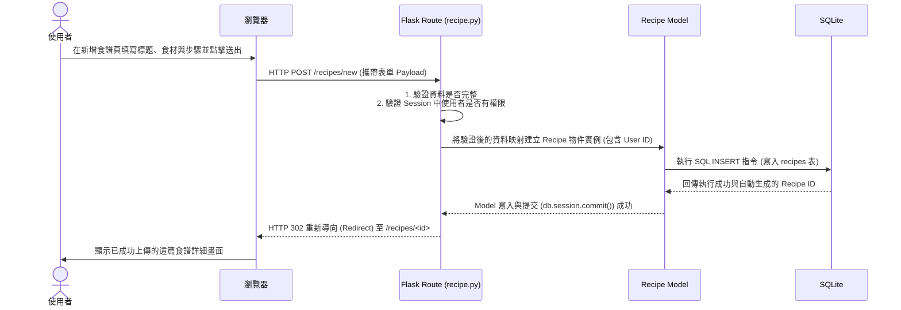

# 流程圖文件 (Flowchart) - 食譜收藏夾系統

本文件基於 PRD 確立的核心功能與 Architecture 規劃的路由架構，進一步繪製出使用者的操作路徑與系統內的資料流動方式，提供實作階段更明確的參考指標。

---

## 1. 使用者流程圖（User Flow）

此流程圖展示了使用者進入「食譜收藏夾」網站後的各種可能路徑，包含瀏覽、搜尋、註冊、上傳食譜、互動與生成購物清單等主要動線。

```mermaid
flowchart LR
    Start([使用者首度開啟網頁]) --> Home[首頁<br>(推薦食譜與分類導覽)]
    
    %% 搜尋與瀏覽路徑
    Home --> Search[透過關鍵字或食材篩選]
    Search --> RecipeList[查看搜尋結果列表]
    Home --> RecipeList
    
    RecipeList --> RecipeDetail[檢視食譜詳細內容]
    
    %% 註冊登入檢查與核心互動
    RecipeDetail --> Action{是否已登入？}
    Action --否--> AuthSys[前往登入 / 註冊頁面]
    AuthSys --> Action
    
    Action --是--> LoggedInActions{使用者欲執行之操作}
    LoggedInActions -->|加入收藏| SaveRecipe[選擇分類並存入收藏夾]
    LoggedInActions -->|留下評價| Rate[填寫星級評價與留言]
    LoggedInActions -->|準備採買| ConvertShopping[將該食譜轉換為購物清單]
    
    %% 個人中心相關路徑
    Home --> Profile[前往個人主頁 / 管理中心]
    Profile --> UserLists[管理已收藏的食譜與購物清單]
    Profile --> UploadProcess[發佈自創食譜]
    UploadProcess --> FillForm[填寫食材、步驟與照片]
    FillForm --> UserLists
```

---

## 2. 系統序列圖（Sequence Diagram）

此序列圖以核心的「使用者建立並上傳自創食譜」流程為例，展示了前端瀏覽器如何透過 Flask 控制器，並經過 Model 存入 SQLite 資料庫的完整資料流。



---

## 3. 功能清單對照表

下表列出 PRD 規劃的功能與建議分配的 Flask 路由端點（Endpoints）及對應的 HTTP Method，作為後續後端開發（Controller / Route）的實作清單。

| 功能分類 | 具體功能描述 | 對應的 URL 路徑 | HTTP 方法 |
| --- | --- | --- | --- |
| **帳號驗證** | 使用者註冊帳號 | `/auth/register` | GET, POST |
| **帳號驗證** | 使用者登入帳號 | `/auth/login` | GET, POST |
| **帳號驗證** | 使用者登出系統 | `/auth/logout` | GET |
| **瀏覽與搜尋** | 系統首頁 (含推薦與熱門清單) | `/` | GET |
| **瀏覽與搜尋** | 關鍵字搜尋與食材料理篩選 | `/recipes/search` | GET |
| **瀏覽與搜尋** | 檢視單篇食譜詳細內容 | `/recipes/<id>` | GET |
| **食譜管理** | 進入新增/上傳食譜的空白表單 | `/recipes/new` | GET |
| **食譜管理** | 送出新建食譜表單內容至伺服器 | `/recipes/new` | POST |
| **食譜管理** | 編輯或修改既有的自創食譜 | `/recipes/<id>/edit` | GET, POST |
| **食譜管理** | 刪除自創食譜 | `/recipes/<id>/delete` | POST |
| **互動與操作** | 將食譜加入自己的收藏或設定標籤 | `/recipes/<id>/collect` | POST |
| **互動與操作** | 送出針對該食譜的評價與文字留言 | `/recipes/<id>/review` | POST |
| **互動與操作** | 自動解析食譜食材並產出購物清單 | `/profile/shopping-list` | GET, POST |
| **個人主頁** | 查看個人資訊、已收藏食譜與評價 | `/profile` | GET |
